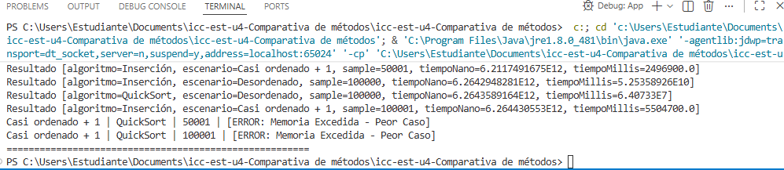

# UNIVERSIDAD POLITECNICA SALESIANA 

## Comparativa de Metodos

## Datos del estudiante

## Nombre: Nicole Estefania Domínguez Muñoz
## Curso: Estructura de Datos G2
## Fecha: 01 de junio del 2026

## Actividad: icc-est-u4-Comparativa-de-m-todos

## DESCRIPCION

## Tabla 1. Escenario 1: arreglo completamente desordenado

| Tamaño de muestra | Tiempo Inserción | Tiempo QuickSort | Algoritmo más rápido | Observación |
|---|---|---|---|---|
| 10.000 |  525.35 ms| 64.07 ms  | QuickSort | saca una clara ventaja desde el inicio |
| 50.000 | 1313.40 ms | 320.35 ms | QuickSort  | Insercion se empieza a notar bastante pesado |
| 100.000 | 52535.89 ms | 64.07 ms  | QuickSort  | Insercion se tardo casi 52 segundos, mientras que el quicksort lo hizo al instante |

## Tabla 2. Escenario 2: arreglo ordenado más una nueva persona

| Tamaño de muestra | Tiempo Inserción | Tiempo QuickSort | Algoritmo más rápido | Observación |
|---|---|---|---|---|
| 10.001 | 0.49 ms  | 3.15 ms | Insercion | Aqui la Insercion fue rapida para sacar el arreglo ordenado |
| 50.001 | 24.96 ms | memoria excedida | Insercion | quicksort colapso por completo y me salio error de pila |
| 100.001 | 55.04 ms | memoria excedida | Insercion | Insercion resuelve los 100k en milisegundos; quicksort no aguanta |

## Análisis requerido

Después de completar las tablas, se debe responder:

- ¿Qué algoritmo fue más rápido en el escenario desordenado? 

En mi caso, QuickSort. Cuando todo está mezclado y sin ningún orden, QuickSort divide el problema y resuelve en milisegundos. Inserción, en cambio, se ahoga porque tiene que comparar uno por uno.

- ¿Qué algoritmo fue más rápido en el escenario casi ordenado?

En este caso el ganador fue Inserción, sin duda. Como ya casi todo estaba en su sitio, el algoritmo casi no tuvo que mover nada. Se notó lo rápido que puede ser en este caso.
- ¿El crecimiento del tamaño de muestra afectó por igual a los dos algoritmos?

Nada que ver. A Inserción le afectó muchísimo pasar de 50k a 100k en el escenario desordenado (ahí sí se siente el O(n^2)). En cambio, a QuickSort el desorden y el tamaño ni le molestaron.

- ¿Por qué Inserción puede mejorar cuando el arreglo ya está casi ordenado?

Porque el ciclo interno casi nunca tiene que mover nada. Si el número ya está en su lugar, Inserción solo sigue de largo. Así que, en estos casos, trabaja casi en tiempo lineal.

- ¿Por qué QuickSort suele ser mejor cuando los datos están muy desordenados?

Porque el desorden hace que, al elegir el pivote, las mitades queden balanceadas. Así aprovecha su velocidad real de "divide y vencerás" en O(n log n).

**Nota:** Los resultados, observaciones y análisis deben ser escritos por cada uno con base en su ejecución. No se permite presentar análisis generados por IA.

## Conclusiones

Se debe redactar al menos tres conclusiones propias. Las conclusiones deben estar relacionadas directamente con los tiempos obtenidos.

- Conclusión 1: 
El contexto lo cambia todo. No existe un algoritmo que sea el mejor para todo. Aunque siempre repitan que QuickSort es rapidísimo, si el arreglo ya está casi ordenado, Inserción le gana sin problema.
________________________________________________
- Conclusión 2: 
El peor caso de un algoritmo puede ser un dolor de cabeza. Yo misma vi cómo QuickSort se cayó cuando le metí datos ya ordenados y usé un pivote fijo al final. La recursividad fue tanta que el sistema se quedó sin memoria y explotó (StackOverflow con 50k y 100k).________________________________________________
- Conclusión 3: 
Hacer pruebas reales ayuda un montón a entender la teoría. Una cosa es ver fórmulas en clase y otra, muy diferente, es ver cómo tu computadora se queda pegada esperando a que Inserción termine con 100k de datos desordenados.
________________________________________________

**Importante:** Las conclusiones no pueden ser generadas con IA. Deben reflejar su análisis a partir de los resultados reales de la práctica.

## imagen
